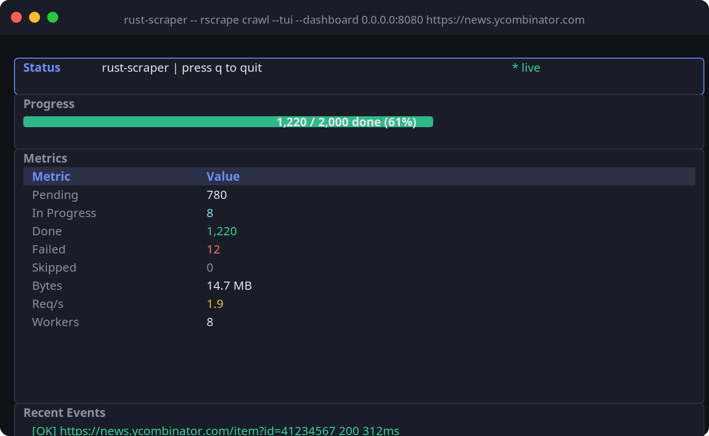

# rust-scraper

A production-grade Rust web scraper framework — hybrid HTTP/headless rendering, recursive crawler, CSS + XPath extraction, live TUI, web dashboard, SQLite persistence, and a single self-contained binary.



## Architecture

11-crate Cargo workspace with clear separation of concerns:

```
scraper-core        — domain types + trait interfaces (Fetcher, SelectorEngine, StateStore, …)
scraper-extractor   — CSS (scraper crate) + XPath (skyscraper) extraction engines
scraper-config      — TOML → env-var → CLI flag layered config via figment
scraper-metrics     — AtomicU64 counters + watch snapshots + broadcast events
scraper-storage     — SQLite WAL-mode state store + result sink (rusqlite)
scraper-fetch-http  — reqwest fetcher with per-host token-bucket rate limiting (governor)
scraper-browser     — headless browser backend trait (chromiumoxide, feature-gated)
scraper-engine      — coordinator actor + tokio worker pool
scraper-tui         — ratatui terminal UI with live metrics gauges
scraper-dashboard   — axum SSE web dashboard (frontend embedded via rust-embed)
scraper-cli         — rscrape binary, wires everything together
```

## Quick Start

```bash
cargo build --release
./target/release/rscrape crawl https://example.com
```

### With TUI and web dashboard

```bash
./target/release/rscrape crawl \
  --tui \
  --dashboard 127.0.0.1:8080 \
  --db crawl.db \
  https://example.com
```

Then open `http://localhost:8080` for the live metrics dashboard.

### With a config file

```toml
# scraper.toml
seeds      = ["https://example.com"]
max_depth  = 3
concurrency = 8

[rate_limit]
requests_per_second = 2.0
burst               = 5

[output]
type = "sqlite"
path = "results.db"
```

```bash
./target/release/rscrape crawl --config scraper.toml
```

## Features

| Feature | Details |
|---------|---------|
| **CSS selectors** | `scraper` crate, full CSS3 selector support |
| **XPath 1.0** | `skyscraper`, opt-in via `xpath` feature |
| **Rate limiting** | Per-host token bucket via `governor` |
| **Persistence** | SQLite WAL-mode frontier + results |
| **Resume** | Crash-safe: reclaims in-flight URLs on restart |
| **TUI** | `ratatui` real-time progress, metrics, req/s gauge |
| **Dashboard** | SSE-streaming metrics, no build step, embedded HTML |
| **Headless browser** | `chromiumoxide` behind `chromium` feature flag |
| **WASM-ready core** | `scraper-core`, `scraper-extractor`, `scraper-config` compile to `wasm32-unknown-unknown` |

## Running Tests

```bash
cargo test --workspace
```

24 tests across 6 crates, all passing.

## Binary Size

~9 MB release binary (includes SQLite, HTML/XPath parsers, TLS, TUI, embedded web dashboard).
